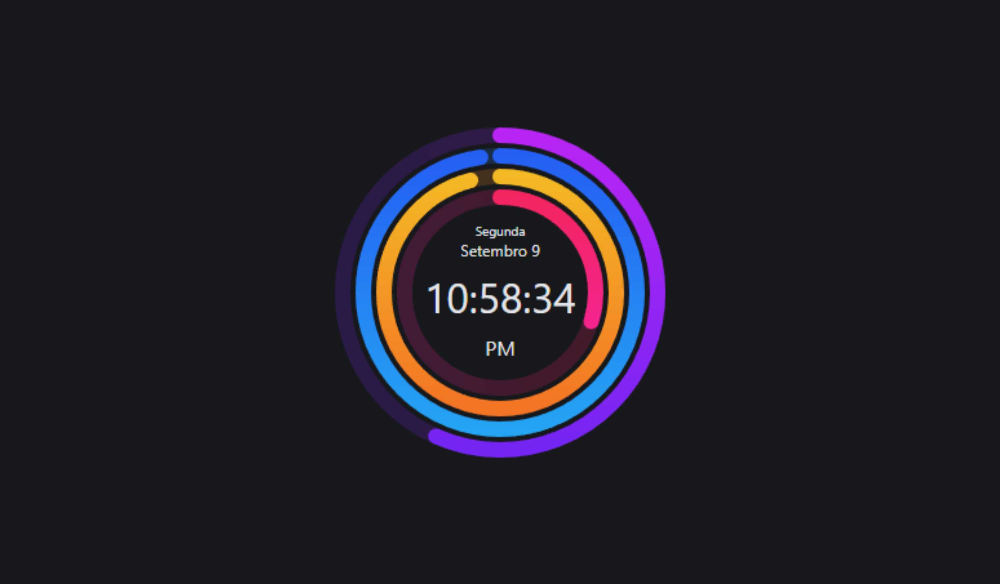

# Relogio Digital Progressivo

## Sobre o projeto

Um relógio digital que mostra a hora atual, e preenche seus aneis coloridos externos de acordo com a progressão dos dias, horas, minutos e segundos.

## Informações

Projeto desenvolvido utilizando apenas HTML, CSS e JavaScript.

